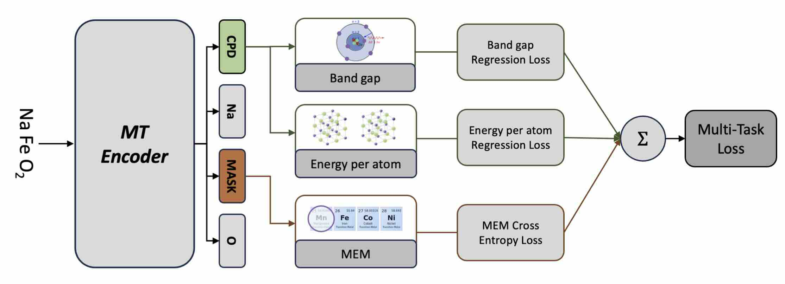
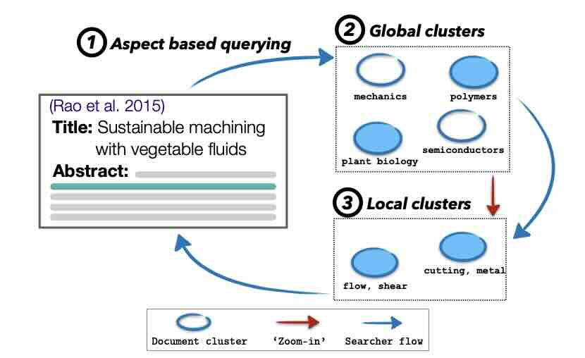
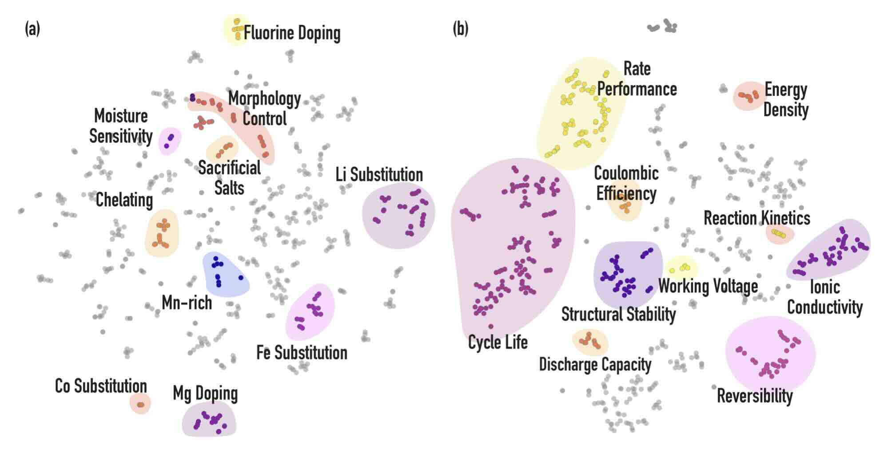
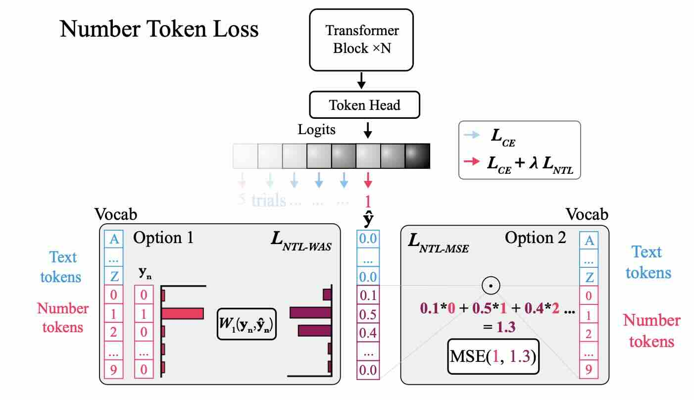

## 👋 Hi, I'm Thorben – a 3rd-year PhD at TUM, exploring the intersection of Machine Learning and Materials Discovery! 🚀  

I’m passionate about advancing materials science by integrating state of the art AI techniques. My contributions span from materials representation learning to NLP. 🌟  

---
### 🧪 **Materials Science**

**MTENCODER: A Multi-task Pretrained Transformer Encoder for Materials Representation Learning**  
- Developed a transformer-based encoder co-trained across diverse materials properties and a denoising objective, resulting in robust and generalizable materials representations.
- **Methods**: Multi-task Learning, Transformer Architecture, Denoising Autoencoders
- **Paper**: [(NeurIPS AI4Mat) MTENCODER: A Multi-task Pretrained Transformer Encoder for Materials Representation Learning](https://openreview.net/pdf?id=wug7i3O7y1) 
  

    
  

**MTENCODER: A Multi-task Pretrained Transformer Encoder for Materials Representation Learning**  
- Developed a transformer-based encoder co-trained across diverse materials properties and a denoising objective, resulting in robust and generalizable materials representations.
- **Methods**: Multi-task Learning, Transformer Architecture, Denoising Autoencoders
- **Paper**: [(NeurIPS AI4Mat) MTENCODER: A Multi-task Pretrained Transformer Encoder for Materials Representation Learning](https://openreview.net/pdf?id=wug7i3O7y1) 
  

  
  

  
---
### 📖 **Natural Language Processing**

**Augmenting Scientific Creativity with Retrieval across Knowledge Domains**  
- Developed an exploratory search system enabling scientists to select core text from a paper abstract and retrieve cross-domain papers with high similarity, facilitating knowledge transfer across scientific domains.  
- **Methods**: Sentence Transformers, Clustering Techniques & Metrics  
- **Paper**: [(NAACL 2022) Augmenting Scientific Creativity with Retrieval across Knowledge Domains](https://arxiv.org/pdf/2206.01328)  
- **Code**: [GitHub Repository](https://github.com/olivettigroup/cross-domain-exploration)  

  

**Extracting a Database of Challenges and Mitigation Strategies for Sodium-ion Battery Development**  
- Created a detailed database highlighting performance and synthesis challenges in sodium-ion battery (SIB) cathode materials, alongside proposed mitigation strategies, to accelerate SIB research and development.
- **Methods**: Open Information Extraction, Named Entity Recognition, Coreference Resolution 
- **Paper**: [(NeurIPS AI4Mat) Extracting a Database of Challenges and Mitigation Strategies for Sodium-ion Battery Development](https://openreview.net/pdf?id=3GiwwOJ1be)  
- **Code**: [GitHub Repository](https://github.com/olivettigroup/NLP4SIB)  
  

    
  
 

**Regress, Don't Guess – A Regression-like Loss on Number Tokens for Language Models**  
- Introduced a novel loss function that enhance language models' numerical reasoning by considering the proximity between number tokens, thereby improving arithmetic capabilities.  
- **Methods**: Autoregressive Transformers (T5) 
- **Paper**: [(NeurIPS MathAI) Regress, Don't Guess – A Regression-like Loss on Number Tokens for Language Models](https://arxiv.org/pdf/2411.02083)  
- **Code**: [GitHub Repository](https://github.com/tum-ai/number-token-loss)  
  

    
  

**Generative Diffusion Model for Materials Synthesis**  
- Designing a chemically guided diffusion model for planning and optimizing materials synthesis.  

**Reaction Graph Networks**  
- Predicting synthesis conditions of solid-state materials using reaction graph networks to enable efficient material discovery.  

---
